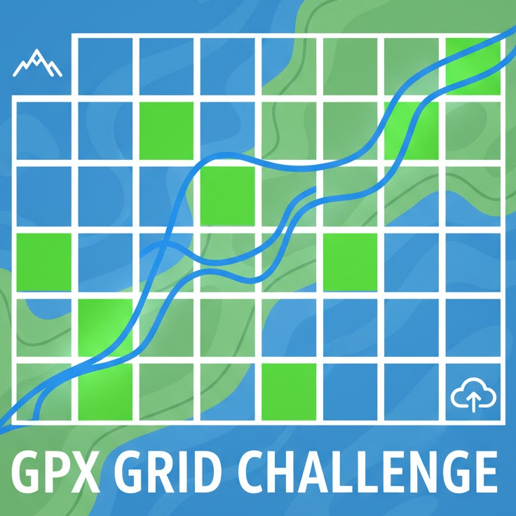

<p align="center">
  
</p>

# GPX Grid Challenge

Chase every map tile you have ever crossed. GPX Grid Challenge is a Next.js dashboard where you upload GPX tracks, tag them per sport, and watch an OpenStreetMap overlay fill up as you explore.

## Highlights

- Upload individual or bulk GPX files, categorize them per sport, and watch the live grid re-color as you toggle each activity.
- Adjustable dashboard layout with a resizable sidebar so you can prioritize the map or statistics panel.
- Activity list sorting/grouping plus quick map controls for hiding, highlighting, or zooming to any track.
- Optional Clerk auth: configure it for multi-user dashboards or skip it for instant single-user mode.
- Strava sync via OAuth to import your latest efforts without manually exporting GPX files.
- Offline-friendly local storage (or optional S3-compatible bucket storage) keeps imported activities available between sessions.

## Quick Start

1. Ensure you have Node.js 18.18+ and `pnpm`.
2. Copy the sample environment file and provide your keys from the [Clerk dashboard](https://clerk.com/) (and/or optional Strava app). If you skip the Clerk keys the app runs in single-user mode using the storage id below.

   ```bash
   cp .env.example .env.local
   ```

   | Variable | Purpose |
   | --- | --- |
   | `NEXT_PUBLIC_CLERK_PUBLISHABLE_KEY` | Browser key required by Clerk |
   | `CLERK_SECRET_KEY` | Server-side Clerk key used by middleware and API routes |
   | `DEV_STORAGE_USER_ID` (optional) | Storage folder for single-user mode (defaults to `dev-user`) |
   | `STRAVA_CLIENT_ID` / `STRAVA_CLIENT_SECRET` | OAuth credentials for Strava syncing |
   | `STRAVA_REDIRECT_URI` | Redirect URL registered in Strava (e.g. `http://localhost:3000/strava/callback`) |
   | `STRAVA_SCOPE` (optional) | Override the default `read,activity:read_all` scopes |
   | `STORAGE_DRIVER` (optional) | Force `local` or `bucket`; otherwise auto-detected |
   | `STORAGE_BUCKET_NAME` (optional) | Enables bucket storage when combined with credentials |
   | `STORAGE_BUCKET_REGION` (optional) | Region for the bucket (defaults to `us-east-1`) |
   | `STORAGE_BUCKET_ENDPOINT` (optional) | Custom endpoint (e.g. Cloudflare R2) |
   | `STORAGE_BUCKET_PREFIX` (optional) | Folder/prefix inside the bucket for all objects |
   | `STORAGE_BUCKET_ACCESS_KEY_ID` / `STORAGE_BUCKET_SECRET_ACCESS_KEY` | Credentials for bucket access (falls back to `AWS_*` env vars) |
   | `STORAGE_BUCKET_SESSION_TOKEN` (optional) | Session token for temporary credentials |
   | `STORAGE_BUCKET_FORCE_PATH_STYLE` (optional) | Set to `true` to always use path-style URLs |

   The Strava section in the dashboard only appears when the three required `STRAVA_*` variables above are configured.

3. Install and run the dev server:

   ```bash
   pnpm install
   pnpm dev
   ```

4. Visit [http://localhost:3000](http://localhost:3000), sign in with your Clerk user, or simply start uploading `.gpx` files if Clerk is disabled.

## Remote bucket storage (optional)

By default the server writes GPX-derived GeoJSON, Strava sync state, and activity metadata to `./storage` on the local disk. If you
want to share data between deployments, set `STORAGE_BUCKET_NAME` along with credentials for any S3-compatible bucket. When the
environment is configured the API routes will transparently read/write objects via signed HTTPS requests; local mode remains
available for development or offline use.

At minimum you need `STORAGE_BUCKET_NAME`, credentials (`STORAGE_BUCKET_ACCESS_KEY_ID` / `STORAGE_BUCKET_SECRET_ACCESS_KEY` or the
standard `AWS_ACCESS_KEY_ID` / `AWS_SECRET_ACCESS_KEY`), and optionally a `STORAGE_BUCKET_REGION`. Provide `STORAGE_BUCKET_ENDPOINT`
(plus `STORAGE_BUCKET_FORCE_PATH_STYLE=true`) when targeting providers such as Cloudflare R2 that require path-style URLs.

## Strava Sync (optional)

1. Create an application at [Strava](https://www.strava.com/settings/api) with your local redirect URL.
2. Fill in the Strava environment variables described above and restart `pnpm dev` so they are picked up.
3. Connect your account from the "Strava sync" card in the dashboard to pull recent activities; duplicates are ignored automatically.
